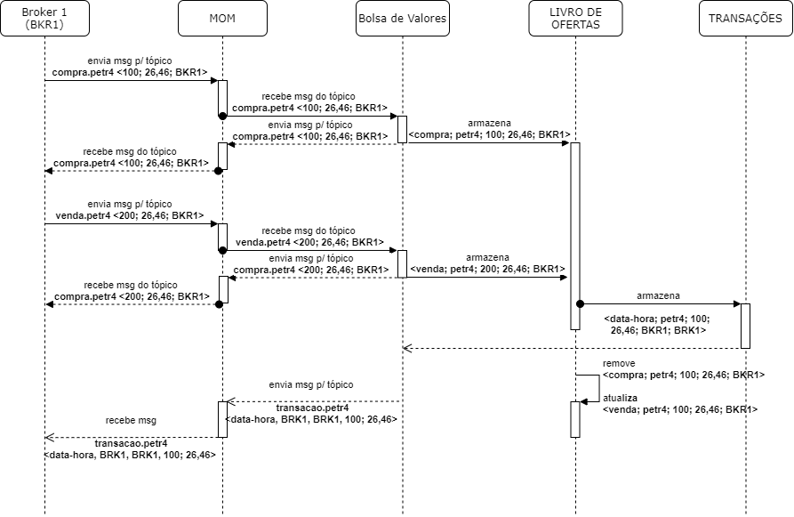

# Trabalho - Corretora de Valores com Rabbit MQ

## Alunos

[Arthur Rocha Amaral](https://github.com/ArthurRAmaral)

[Guilherme Oliveira Antônio](https://github.com/guilhermegoa)

---

## Professor

Hugo Bastos De Paula

---

## Descrição

O trabalho consiste em desenvolver um pequeno aplicativo para o Broker e outro aplicativo para a Bolsa de valores, utilizando filas de mensagens e estruturas de tópicos. Os requisitos do trabalho são:

- O endereço do RabbitMQ server deve ser passado como parâmetro para que brokers e bolsas possam escolher a quem se conectar.
- A bolsa deve abrir um canal do tipo pub/sub utilizando tópicos para publicar as atualizações no livro de ofertas e as operações realizadas em uma ação. O nome do canal deve ser BOLSADEVALORES.
- O servidor abre uma fila de mensagens para receber as operações dos clientes. O nome da fila de mensagens deve ser BROKER.
- Os clientes enviam operações para o servidor através da fila de mensagens BROKER.
- Todos os clientes devem receber a notificação das operações através da fila BOLSADEVALORES.
- O servidor deverá ser disponibilizado em uma máquina diferente de localhost.
- O aplicativo deve funcionar nas máquinas Linux do laboratório de redes do curso de Engenharia de Software da PUC Minas.



---

### Oque foi usado

- Docker
- RabbitMQ
- NestJS (framework nodejs)

---

## Docker

O projeto foi desenvolvido para rodar todo em docker, onde no arquivo `docker-compose.yml` é criado toda a estrutura para rodar o projeto. Dessa forma, ao iniciar como o comando `docker-compose up` é iniciado duas api's corretoras, uma api de bolsa de valores e o rabbitMq.

## RabbitMq

O rabbitMq é inicado para ser feita a comunição entre a bolsa de valores e a corretora, enviando mensagens em tempo real para saber quando ocorre compra, venda e transação.

## NestJs

#### Corretora 

A corretora tem função de fazer a conexao como cliente e a bolsa de valores. Dessa forma, ela usa do serviço do rabbitMq para fazer a conexão artaves de mesangens, as quais podem ser de venda e compra. Assim, sendo salvas no em cache e quando ocorre a compatibilidade entre uma compra e venda, ocorre uma transação, onde a bolsa recebe que ocorreu essa transaçãoe transmite via web socket para o front.

Esse é o serviço que disponibiliza o html para o teste.

#### Bolsa de valores

A Bolsa tem a função de processar e salvar o pedido de compra e venda e salvar no livro de ofertas, o qual tem o intuito de verificar se ocorre uma compra.  

## Diagrama de componentes

> TO DO

---

## Pré-requisitos

- Docker
- Docker-compose

## Como usar

Para ultilizar basta roda o comando abaixo.

```sh
docker-compose up
```

### O que é iniciado:

- RabbitMq
- Corretora 2x
- Bolsa de valores

### Como testar:

- http://localhost:3001 - Corretora 1
- http://localhost:3002 - Corretora 2
